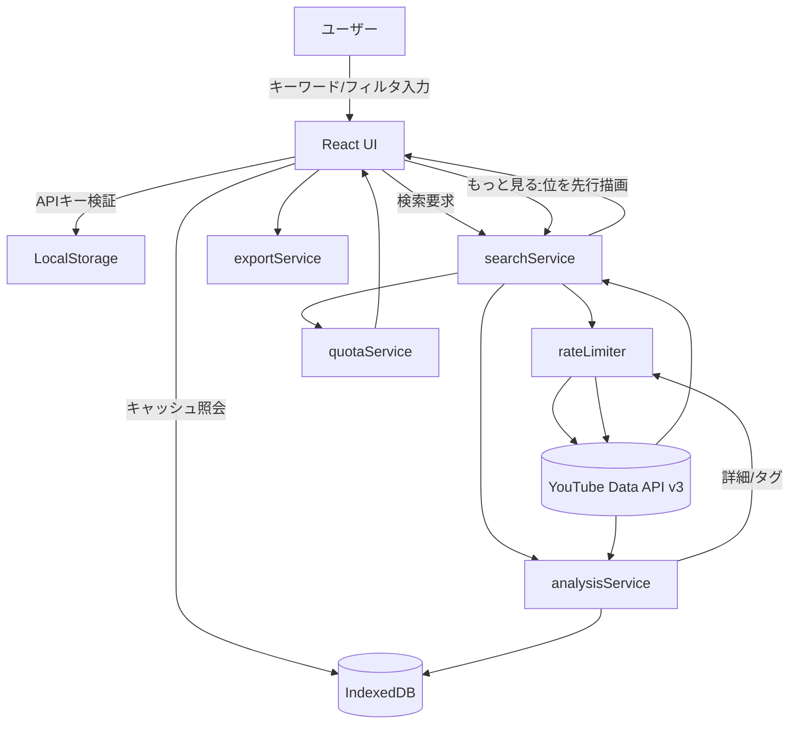
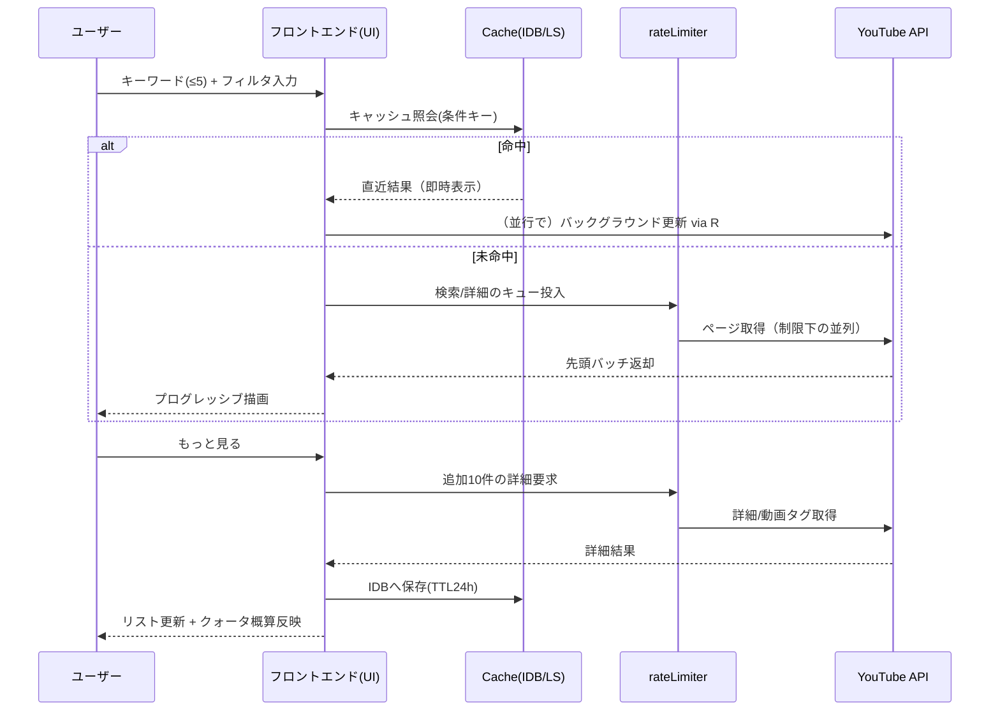

# データフロー図

## ユーザーインタラクションフロー

```mermaid
flowchart TD
    U[ユーザー] -->|キーワード/フィルタ入力| UI[React UI]
    UI -->|APIキー検証| LS[LocalStorage]
    UI -->|キャッシュ照会| IDB[(IndexedDB)]
    UI -->|検索要求| SRV[searchService]
    SRV --> RL[rateLimiter]
    RL --> YT[(YouTube Data API v3)]
    YT --> SRV
    SRV -->|上位を先行描画| UI
    UI -->|もっと見る| SRV
    SRV --> ANA[analysisService]
    ANA -->|詳細/タグ| RL
    RL --> YT
    YT --> ANA
    ANA --> IDB
    SRV --> QUO[quotaService]
    QUO --> UI
    UI --> EXP[exportService]
```

## データ処理フロー（詳細シーケンス）

```mermaid
sequenceDiagram
    participant U as ユーザー
    participant F as フロントエンド(UI)
    participant C as Cache(IDB/LS)
    participant R as rateLimiter
    participant Y as YouTube API

    U->>F: キーワード(≤5) + フィルタ入力
    F->>C: キャッシュ照会(条件キー)
    alt 命中
      C-->>F: 直近結果（即時表示）
      F->>Y: （並行で）バックグラウンド更新 via R
    else 未命中
      F->>R: 検索/詳細のキュー投入
      R->>Y: ページ取得（制限下の並列）
      Y-->>F: 先頭バッチ返却
      F-->>U: プログレッシブ描画
    end
    U->>F: もっと見る
    F->>R: 追加10件の詳細要求
    R->>Y: 詳細/動画タグ取得
    Y-->>F: 詳細結果
    F->>C: IDBへ保存(TTL24h)
    F-->>U: リスト更新 + クォータ概算反映
```
