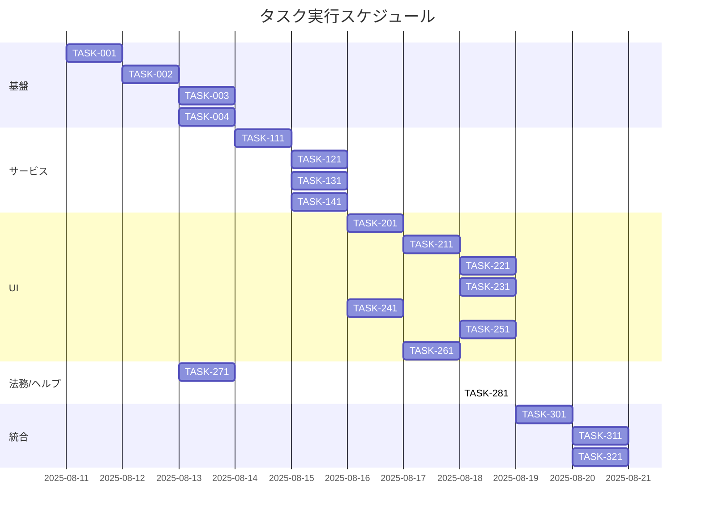

# YouTube検索・分析ツール 実装タスク

## 概要

全タスク数: 22
推定作業時間: 8〜12日（1人）
クリティカルパス: TASK-002 → TASK-111 → TASK-201 → TASK-251 → TASK-301

## タスク一覧

### フェーズ1: 基盤構築

#### TASK-001: リポジトリ初期整備
- [ ] **タスク完了**
- **タスクタイプ**: DIRECT
- **要件リンク**: REQ-405, NFR-301
- **依存タスク**: なし
- **実装詳細**:
  - Vercelプロジェクト準備、環境（フロントのみ）
  - CI（任意）: Lint/Typeチェック
- **テスト要件**:
  - [ ] ビルド成功
  - [ ] デプロイプレビュー有効

#### TASK-002: クライアント基盤と状態管理
- [ ] **タスク完了**
- **タスクタイプ**: DIRECT
- **要件リンク**: REQ-001, REQ-005, NFR-201
- **依存タスク**: TASK-001
- **実装詳細**:
  - React + Bootstrapセットアップ
  - 検索フォーム/結果リスト/ローディングUIの骨組み
  - 共通トースト/ダイアログ/アクセシビリティ下地
- **UI/UX要件**:
  - [ ] ローディング: シマー/フェーズ表示
  - [ ] エラー: トースト+リトライ
  - [ ] A11y: キーボード操作

#### TASK-003: ストレージ（LocalStorage/IndexedDB）ユーティリティ
- [ ] **タスク完了**
- **タスクタイプ**: DIRECT
- **要件リンク**: REQ-402, REQ-404, NFR-102
- **依存タスク**: TASK-002
- **実装詳細**:
  - APIキー保存/取得、安全な扱い
  - IndexedDBラッパ（オブジェクトストア: channel_basic, channel_keywords, channel_video_tags）
  - TTL 24hサポート
- **テスト要件**:
  - [ ] 保存/取得/削除
  - [ ] TTL切れの無効化

#### TASK-004: レート制限/並列実行ユーティリティ
- [ ] **タスク完了**
- **タスクタイプ**: DIRECT
- **要件リンク**: REQ-006
- **依存タスク**: TASK-002
- **実装詳細**:
  - トークンバケツ/キュー実装（RPS/同時実行）
  - AbortController対応
- **テスト要件**:
  - [ ] RPS上限超過が発生しない
  - [ ] キャンセル/再試行

### フェーズ2: API/サービスレイヤ

#### TASK-111: YouTubeクライアント/サービス
- [ ] **タスク完了**
- **タスクタイプ**: TDD
- **要件リンク**: REQ-001, REQ-006, REQ-401
- **依存タスク**: TASK-003, TASK-004
- **実装詳細**:
  - axiosクライアント、検索/channels/videosエンドポイント
  - 型: `interfaces.ts` に準拠
  - クォータ概算の収集
- **単体テスト要件**:
  - [ ] 正常/レート制限/ネットワーク失敗
  - [ ] レスポンスマッピング

#### TASK-121: 検索サービス（段階表示/もっと見る）
- [ ] **タスク完了**
- **タスクタイプ**: TDD
- **要件リンク**: REQ-001, REQ-003, REQ-005, REQ-103, REQ-104, REQ-008
- **依存タスク**: TASK-111
- **実装詳細**:
  - キャッシュ即時提示→BG更新
  - バッチ結果でのプログレッシブ描画
  - nextPageToken管理/10件追加
- **単体テスト要件**:
  - [ ] キャッシュ命中/未命中
  - [ ] もっと見るで10件追加

#### TASK-131: 詳細分析/タグ収集サービス
- [ ] **タスク完了**
- **タスクタイプ**: TDD
- **要件リンク**: REQ-004, REQ-106
- **依存タスク**: TASK-111
- **実装詳細**:
  - 対象上限20件の制御
  - 動画タグの取得（本数はプラン準拠）
- **単体テスト要件**:
  - [ ] 上限超過時の抑制
  - [ ] タグ収集件数の遵守

#### TASK-141: クォータ監視サービス
- [ ] **タスク完了**
- **タスクタイプ**: TDD
- **要件リンク**: REQ-007, REQ-106
- **依存タスク**: TASK-111
- **実装詳細**:
  - 概算の集計/閾値警告
  - UI反映用のイベント
- **単体テスト要件**:
  - [ ] 閾値下回り時の抑制シグナル

### フェーズ3: フロントエンドUI

#### TASK-201: 検索フォーム/フィルタUI
- [ ] **タスク完了**
- **タスクタイプ**: TDD
- **要件リンク**: REQ-001, REQ-002, REQ-105
- **依存タスク**: TASK-121
- **UI/UX要件**:
  - [ ] キーワード最大5件、入力バリデーション
  - [ ] 最低登録者/再生回数、開設日（最大6ヶ月）
  - [ ] APIキー未設定時のガード/設定導線
- **統合テスト要件**:
  - [ ] 条件入力→結果反映

#### TASK-211: 結果リスト/カード（シマー/段階描画）
- [ ] **タスク完了**
- **タスクタイプ**: TDD
- **要件リンク**: REQ-003, REQ-005, REQ-201
- **依存タスク**: TASK-201
- **UI/UX要件**:
  - [ ] 名称/サムネ/登録者/総再生/開設日
  - [ ] シマー/フェーズ表示
- **統合テスト要件**:
  - [ ] 部分表示→最終表示

#### TASK-221: もっと見る/ページング
- [ ] **タスク完了**
- **タスクタイプ**: TDD
- **要件リンク**: REQ-103
- **依存タスク**: TASK-211
- **UI/UX要件**:
  - [ ] 10件ずつ追加
  - [ ] ローディングの一貫表示

#### TASK-231: 詳細分析/タグ表示
- [ ] **タスク完了**
- **タスクタイプ**: TDD
- **要件リンク**: REQ-004
- **依存タスク**: TASK-211, TASK-131
- **UI/UX要件**:
  - [ ] 対象選択上限20件
  - [ ] タグの視認性/並べ替え

#### TASK-241: クォータUI（残量/警告）
- [ ] **タスク完了**
- **タスクタイプ**: TDD
- **要件リンク**: REQ-007
- **依存タスク**: TASK-141
- **UI/UX要件**:
  - [ ] 閾値下回り警告
  - [ ] 高コスト操作のボタン無効化

#### TASK-251: エクスポート/カード保存
- [ ] **タスク完了**
- **タスクタイプ**: TDD
- **要件リンク**: REQ-301, REQ-302
- **依存タスク**: TASK-211
- **UI/UX要件**:
  - [ ] CSV出力（toB）、透かし解除
  - [ ] 画像カード保存（toC）

#### TASK-261: 保存セット（条件保存/復元）
- [ ] **タスク完了**
- **タスクタイプ**: TDD
- **要件リンク**: REQ-303
- **依存タスク**: TASK-201, TASK-003
- **UI/UX要件**:
  - [ ] toC最大5件、toB最大10件

### フェーズ4: 法務/ヘルプ/設定

#### TASK-271: 規約・プライバシーポリシー・データ削除
- [ ] **タスク完了**
- **タスクタイプ**: DIRECT
- **要件リンク**: REQ-404, NFR-102
- **依存タスク**: TASK-002
- **実装詳細**:
  - 画面に法的文書表示
  - LocalStorage/IndexedDB削除UI

#### TASK-281: アップセルUI（Pro/Business）
- [ ] **タスク完了**
- **タスクタイプ**: DIRECT
- **要件リンク**: REQ-202
- **依存タスク**: TASK-211

### フェーズ5: 統合・品質

#### TASK-301: E2Eテスト（主要フロー）
- [ ] **タスク完了**
- **タスクタイプ**: TDD
- **要件リンク**: 全要件
- **依存タスク**: TASK-251
- **実装詳細**:
  - Playwright/Cypressで主要シナリオ
  - P50/P90計測

#### TASK-311: パフォーマンス最適化/計測
- [ ] **タスク完了**
- **タスクタイプ**: DIRECT
- **要件リンク**: NFR-001, NFR-002, NFR-003
- **依存タスク**: TASK-301

#### TASK-321: デプロイ整備
- [ ] **タスク完了**
- **タスクタイプ**: DIRECT
- **要件リンク**: REQ-405, NFR-301
- **依存タスク**: TASK-301
- **実装詳細**:
  - Vercel連携、mainマージで自動デプロイ

## 実行順序（ガント）

